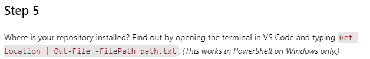

# Typing Profile

> Open this repository folder in VS Code, then open the `ReadMe.md` file to begin following the instructions. You should click on the preview icon () to preview the markdown content in your editor.
>
> Also, ensure all your workspace-recommended extensions are installed and working before you begin the steps below. Take some time to practice typing using the [**Warm Up - Typing test**](https://marketplace.visualstudio.com/items?itemName=Jeusto.warm-up-typing-test) extension.

----

----

----

----

----

----
